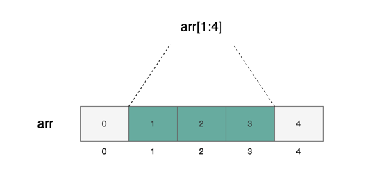
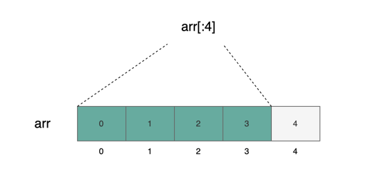
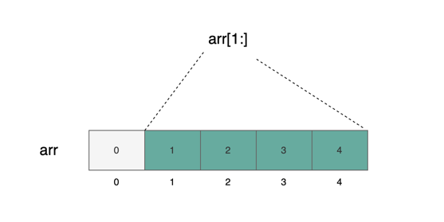
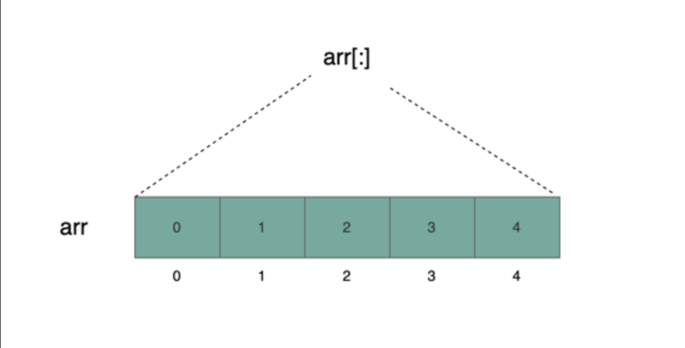
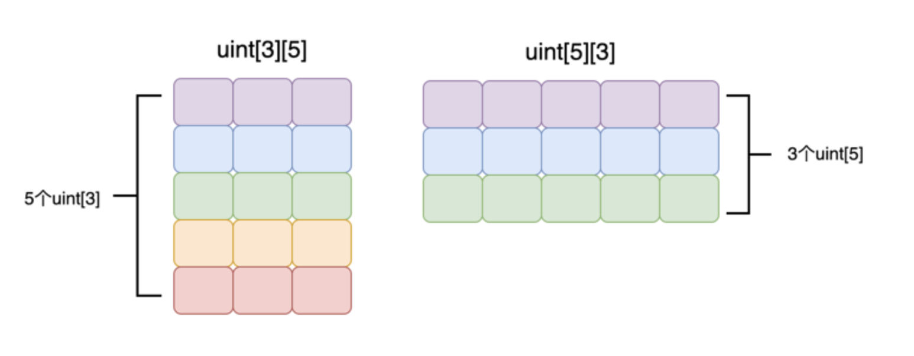

# 数据类型
- 值类型（value type）
    - 布尔类型
    - 整型
        - int 
        - int8-256(8的倍数)
        - uint
        - int8-256(8的倍数)
    - 静态浮点型
    - 地址
    - 静态字节数组（bytes1-32）
    - 枚举类型
    - 自定义值类型
    - 字面值
        - 地址字面值
        - 有理数和整数字面值
        - 字符串字面值
        - Unicode 字面值
- 引用类型（Reference type）
    - 数组
        - 固定长度数组
        - 动态数组
        - 特殊数组
            - bytes
            - string
    - 结构体
    - 映射类型

# 数据位置
- 内存（memory）
    数据存储在内存中，是临时的，当函数调用结束后数据就会消失。
- 存储（storage）
    数据永久存储在区块链上，通常用于状态变量。
- 调用数据 (calldata)
    数据存储在一个专门用于存放函数参数的区域，这也是临时的。
在这些存储位置中，标记为 storage 的数据位置通常关联到我们所说的`状态变量`，它们的数据是永久记录在区块链上的。这种机制确保了区块链数据的不可变性和合约状态的持续性。

# 引用传递（pass by reference）
传递地址的方法通常被称为「引用传递」。在这种方法中，赋值或参数传递时传递的是参数的地址，而不是数据的本身

```solidity
bytes memory bts1 = "btc";
bytes memory bts2 = bts1;

bts2 = bts1;

console.log("bts1: %s", string(bts1)); // bts1: btc
console.log("bts2: %s", string(bts2)); // bts2: btc

bts2[0] = 'e'; //这里只改了bts2[0]的值，但是你会发现bts1[0]的值也会跟着变动

console.log("bts1: %s", string(bts1)); // bts1: etc
console.log("bts2: %s", string(bts2)); // bts2: etc
```

在 Solidity 中，申明「引用类型」时必须指定数据位置（data location），这是为了明确变量的存储方式和生命周期。
声明状态变量时不需要指定。因为状态变量默认存储在 storage 中。在函数内部声明引用类型时必须指定数据位置，常见的数据位置有三种
- storage：数据永久存储在区块链上，其生命周期与合约本身一致
- memory：数据暂时存储在内存中，是易失的，生命周期仅限于函数调用期间
- calldata：
    类似于 memory，但用于存放函数参数，与 memory 不同，calldata中的数据不可修改且相比 memory 更节省gas。
    当引用类型的函数参数不需要修改时，推荐使用 calldata，而非 memory

# 布尔类型
布尔类型是只有 `true` 或 `false` 两种可能取值的类型。在 Solidity 中，布尔类型变量可以使用 `bool` 关键字进行定义。

布尔类型可以使用的运算符和作用如下所示，运算操作后得到的结果依然是布尔类型。
- `!`  （逻辑非）
- `&&` （逻辑与）
- `||` （逻辑或 ）
- `==` （等于）
- `!=` （不等于）

# 整型
整型（integer）是不包含小数部分的数值型数据，包括正整数、负整数和 0 等。账户余额、Gas、持有的 Token 数量等通常都用整型表示。在 Solidity 中，整型有两种类型：

- intM：有符号整型
- uintM：无符号整型

其中，M 的取值范围为 8 到 256，步长为 8。例如，有 `int8`、`int16`、`int32` 等等，一直到 `int256`。相应地，也有 `uint8`、`uint16`、`uint32`，一直到 `uint256`。其中，`int8` 和 `uint8` 占用 8 位（8 bits），`int16` 和 `uint16` 占用 16 位，以此类推。

## 算术运算符
算术运算符可以用来进行四则运算，得到的结果是整型。

- `+`（加）
- `-`（减）
- `*`（乘）
- `/`（除）
- `%`（取模）
- `**`（幂）
- `<<`（左移）
- `>>`（右移）

## 整型溢出
Solidity 中的整型运算可能会出现溢出的情况，导致合约运行时产生不符合预期的行为。在旧版本的 Solidity 中，你可能会使用 OpenZeppelin 的 SafeMath 库来防止整型溢出。然而，在 Solidity 0.8.0 及以上版本中，一旦出现整型溢出，整个交易都会被终止。因此，在这些版本中，Solidity 在处理整型溢出方面是安全的。
```solidity
// SPDX-License-Identifier: GPL-3.0_

pragma solidity ^0.8.17;

contract Integer {
    function overflow() public view {
        uint8 a = 255;
        a = a + 1; //整型溢出，整个transaction revert
        console.log("a=%s", a);
    }
}
```
# 地址类型
地址类型（address）是 Solidity 独有的一种类型，用于存放账户地址。在给其他账户转账或与其他合约交互时，需要使用地址类型。类似于向他人银行账户转账时需要知道对方的账户号码，Solidity 的地址类型也扮演着类似的角色

Solidity 的地址类型用关键字 address 表示。它占据 20 字节（160 位），默认值为 0x0，表示空地址。地址类型可以细分为两种：

- `address`：普通地址类型（不可接收转账）
- `address payable`：可收款地址类型（可接收转账）
```solidity
// 在 Solidity 中，使用地址字面值初始化地址类型变量时，不需要加 "" 或者 ''
address addr = 0x690B9A9E9aa1C9dB991C7721a92d351Db4FaC990;
address payable addr_pay = payable(0x8306300ffd616049FD7e4b0354a64Da835c1A81C);
```
## 为什么要区分 address 和 address payable
Solidity 中账户有两种类型：外部账户（externally owned address，简称 EOA）和合约账户（contract address，简称 CA）。EOA 是我们在 MetaMask 上创建的那些账户，而 CA 是在部署合约后生成的合约地址。

当我们将 Ether 转入 EOA 后，只要我们控制了 EOA 的私钥，就可以将 Ether 再转出来。然而，CA 账户情况则不同。CA 账户是由合约控制的，合约只能执行其定义过的操作。因此，我们必须在合约中实现一个函数，定义如何将账户中的 Ether 转出，否则这些 Ether 会被永远锁在 CA 账户中。

因此，每次向 CA 账户转账时，我们都必须问自己：这个合约是否已经定义了转出 Ether 的逻辑。使用 address payable 明确告诉编译器你已确认转账到该地址是安全的。这不仅提高了合约的安全性，也更方便开发者进行调试。

## 类型转换
```solidity
address payable addr_pay = payable(0x8306300ffd616049FD7e4b0354a64Da835c1A81C);
address addr = addr_pay; // 隐式类型转换

address addr = 0x690B9A9E9aa1C9dB991C7721a92d351Db4FaC990;
address payable addr_pay = payable(addr); // 显式类型转换
```

## 成员变量
- `balance` ：该地址的账户余额，单位是 Wei
- `code` ：该地址的合约代码，EOA 账户为空，CA 账户为非空
- `codehash` ：该地址的合约代码的 hash 值

## 成员函数
- transfer(uint256 amount)：向指定地址转账，失败时抛出异常（仅 `address payable` 可以使用）。
- send(uint256 amount)：与 `transfer` 函数类似，但失败时不会抛出异常，而是返回布尔值（仅 `address payable` 可以使用）。
- call(...)：调用其他合约中的函数。
- delegatecall(...)：与 `call` 类似，但使用当前合约的上下文来调用其他合约中的函数，修改的是当前合约的数据存储。

### transfer
`transfer`函数用于向目标地址转账，可以指定转账数量 `amount`，单位为 Wei。如果发送失败，函数会直接 `revert`。执行此操作的 Gas 固定为 2300。需要注意的是，`transfer` 函数仅 `address payable` 类型可以使用。
```solidity
transfer(uint256 amount)
```

### send
`send` 函数用于向目标地址转账。可以指定转账数量为 `amount`，单位为 Wei 。如果发送失败，函数会返回 `false` 。与 `transfer` 的区别在于，`send` 返回 `false` 而 `transfer` 直接 `revert`。执行此操作的 Gas 同样固定为 2300。需要注意的是，`send` 函数仅 `address payable` 类型可以使用。
```solidity
send(uint256 amount) returns (bool)
```

### call
使用 `call` 函数，可以与合约地址进行交互，调用其函数，或者直接向其转账。`call` 函数返回两个值。第一个是布尔值，用于显示函数调用是否成功。第二个是 `bytes memory` 类型，表示调用对方合约返回的结果。

与 `send` 和 `transfer` 不同的是，`call` 函数可以指定 Gas。通过 `call` 函数，我们也可以向其他地址转账。

```solidity
call(bytes memory) returns (bool, bytes memory)
```

### delegatecall
Delegatecall 是实现代理模式的一种方式。通过使用 `delegatecall`，可以使当前合约使用给定地址的代码，同时继续使用当前合约的存储（如状态变量、账户余额等）。"Delegate"一词意味着委派，即让另一个合约代表当前合约执行特定操作。例如，合约 A 可以委派合约 B 执行某些操作，而 B 合约只是代理执行这些操作，最终的状态变更都记录在合约 A 上。

```solidity
delegatecall(bytes memory) returns (bool, bytes memory)
```
基于 `delegatecall` 的这种特性，OpenZeppelin 提出了代理模式，使得合约升级变得可能

### staticcall
`staticcall` 与 `call` 非常相似。它们唯一的区别在于 `staticcall` 不会修改合约的状态（包括当前合约和被调用的外部合约）。如果在调用过程中发生状态更改（如修改状态变量或更改账户余额），则交易会被立即终止。引入 `staticcall` 提高了合约的安全性，因为一旦使用 `staticcall`，就可以确保调用任何外部合约的函数都不会对状态产生影响。在引入 `staticcall` 之前，需要通过阅读外部合约的代码来确认这一点。

```solidity
staticcall(bytes memory) returns (bool, bytes memory)
```
> 函数 `transfer()` 和 `send()` 只能在 `address payable` 类型中使用。

# 静态字节数组
静态字节数组（fixed-size byte arrays）是 Solidity 中独有的一种数据类型。与其字面意义相符，它们具有固定长度的字节数组。基于静态字节数组，可以构建更为紧凑、节省存储空间的数据类型。

Solidity 共有 32 种静态字节数组：bytes1、bytes2、bytes3，依此类推，直至 bytes32。更好地理解这一概念是将这 32 种静态字节数组视为 32 种不同的值类型，而非通常意义上的数组
```solidity
bytes3 s = 'abc';
bytes1 ch = s[1]; // ch的值为0x62，也就是'b'的ascii值
```
# 枚举值
```solidity
enum ActionChoices { 
    GoLeft,     // 底层表示为 0
    GoRight,    // 底层表示为 1
    GoUp,       // 底层表示为 2
    GoDown      // 底层表示为 3
}

// 枚举的最大最小值
type(ActionChoices).max; // ActionChoices.GoDown 也就是3
type(ActionChoices).min; // ActionChoices.GoLeft 也就是0

// 枚举类型与整型的互相转换
function enumToUint(ActionChoices c) public pure returns(uint) {
    return uint(c);
}

function uintToEnum(uint i) public pure returns(ActionChoices) {
    return ActionChoices(i);
}
```
## 枚举类型作为函数参数或返回值
如果枚举类型仅在当前合约中定义，那么外部合约在调用当前合约时得到的枚举类型返回值会被编译器自动转换成 uint8 类型。因此，外部合约看到的枚举类型实际上是 uint8 类型。这是因为 ABI（应用二进制接口）中不存在枚举类型，只有整型，所以编译器会自动进行这种转换。

```solidity
// SPDX-License-Identifier: GPL-3.0
pragma solidity ^0.8.17;

contract EnumDemo {
    enum ActionChoices { 
        GoLeft,     // 0
        GoRight,    // 1
        GoUp,       // 2
        GoDown      // 3
    }

    ActionChoices choice;

    // 因为ABI中没有枚举类型，所以这里的"getChoice() returns(ActionChoices)"函数签名
    // 会被自动转换成"getChoice() returns(uint8)"
    function getChoice() public view returns (ActionChoices) {
        return choice;
    }
}
```
# 自定义值类型
「自定义值类型」的定义 通过 type C is V 可以定义新的"自定义值类型"，其中 C 是新定义的类型，V 必须是 Solidity 的原生类型。
```solidity
type Weight is uint128;
type Price  is uint128;
```

## 「自定义值类型」有什么好处
- 提高安全性
    ```solidity
    Weight w = Weight.wrap(10);
    Price  p = Price.wrap(5);
    Weight wp = w+p; //编译错误
    Price  pw = p+w; //编译错误

    //代码中会出现编译错误 "TypeError: Operator + not compatible with types UserDefinedValueType.Weight and UserDefinedValueType.Price."，因为 Weight 和 Price 是不同的类型，不能进行算术运算。这种情况下，类型安全性得到了提升，避免了直接使用 uint128 类型可能导致的误用。

    ```
- 提高代码可读性
    提升代码的可读性就显而易见了，在上述例子中，当看到 w 是 Weight 类型时，就能直观地理解 w 代表的是重量；而当看到 p 是 Price 类型时，则明白 p 所表示的是价格。

## 类型转换
- C.wrap：将原生类型转换成自定义值类型。
- C.unwrap：将自定义值类型转换成原生类型。
```solidity
Weight w = Weight.wrap(100);
uint128 u = Weight.unwrap(w);
```

## 运算
`自定义值类型`不会继承原生类型的操作符，包括 + - * / 等。如果你确实需要对 Weight 实现加法运算，那么你必须自己定义一个新的函数。
```solidity
function add(Weight lhs, Weight rhs) public pure returns(Weight) {
  return Weight.wrap(Weight.unwrap(lhs) + Weight.unwrap(rhs));
}
```

# 数组
数组是一种数据结构，用于存储同类型元素的有序集合。根据数组长度是否可以改变，可以将数组分为以下两种类型：
- 静态数组（Static Array）
- 动态数组（Dynamic Array）

## 静态数组的声明
```Solidity
T[arrSize] DataLocation arrName;
```
其中，T 代表数组元素的类型，arrSize 代表数组的长度，DataLocation 代表数组的数据位置（memory 或 storage），arrName 代表数组的名称。
数组是一种引用类型。请注意：在声明和定义数组时，必须使用三个数据位置关键字之一：storage、memory、calldata。

声明静态数组
```solidity
uint[3] memory nftMem; // 所有元素都是 0
uint[3] storage nftStorage;

// 非法声明
uint size = 2;
uint[size][size] memory array; // 非法，size 是变量，不能用来指定数组大小
```

## 动态数组的声明
```solidity
T[] DataLocation arrName;
```
其中 DataLocation 是数据位置，而 arrName 是为这个数组起的任意名字
```solidity
uint[] memory nftMem;
uint[] storage nftStorage;
```
## 数组的初始化
### 静态数组的初始化
```solidity
//必须使用uint(1000)显式地将「数组字面值」第一个元素的类型转换成uint
uint[3] memory nftArr = [uint(1000), 1001, 1002];

// 编译报错，类型不匹配
uint[3] memory nftArr = [1000, 1001, 1002];

// 定义的数组长度必须与数组字面值的长度相匹配，否则会导致编译错误
uint[3] memory nftArr = [uint(1000), 1001];  //编译错误，长度不匹配
```
### 动态数组初始化
```solidity
uint n = 3;
uint[] memory nftArr = new uint[](n);
// 使用 new 关键字可以在任何数据位置创建动态数组。如果动态数组是在 storage 中声明的，你也可以使用数组字面值来初始化：

uint[] storageArr = [uint(1), 2]; // 动态数组只有在storage位置才能用数组字面值初始化

```
**不能把静态数组赋值给动态数组,也不能把动态数组赋值给静态数组**
## 下标访问
```solidity
uint[3] memory nftArr1 = [uint(1000), 1001, 1002];
nftArr1[0] = 2000;
nftArr1[1] = 2001;
nftArr1[2] = 2002;

uint[] memory nftArr2 = new uint[](n);
nftArr2[0] = 1000;
nftArr2[1] = 1001;
nftArr2[2] = 1002;
```
## 动态数组成员函数
- push()：在数组末尾增加一个元素，并赋予零值，使得数组长度增加一。
- push(x)：将元素 x 添加到数组末尾，同样使数组长度增加一。
- pop()：从数组末尾移除一个元素，导致数组长度减少一。

**注意** 只有当动态数组的数据位置为存储（storage）时，才可以使用成员函数 push()， push(x), 和 pop()。

# 数组切片(array slice)
数组切片（array slice）是建立在数组基础上的一种视图（view）。其语法形式为 arr[start:end]。这个视图包含的是从索引 start 到索引 end-1 的元素。与数组不同的是，切片是没有具体类型的，也不会占据存储空间。它是一种方便我们处理数据的抽象方式。
## 多种数组切片表示方式
底层数组 arr 包含了五个元素 [0, 1, 2, 3, 4]。在 arr[1:4] 中，被涂成墨绿色的部分表示一个视图，总共包含了三个元素。根据之前的定义，我们知道 start=1，end=4。因此，这个视图包含了从索引 1 到索引(4-1)=3 的元素。

start 和 end 可以被省略。如果省略了 start，则视图将包含从索引 0 到索引 end-1 的元素：

如果省略了 end，则视图将包含从索引 start 到数组末尾的元素：

如果 start 和 end 都省略了，那么会包含 arr 所有元素：


```solidity
// 如果输入"abcdef"，将会输出"abcd"
function extracFourBytes(string calldata payload) public view {
    string memory leading4Bytes = string(payload[:4]);
    console.log("leading 4 bytes: %s", leading4Bytes);
}
```
目前只能对 calldata 使用数组切片。memory 和 storage 都不可以使用。在 Solidity 中，仅能对 calldata 进行数组切片操作。若尝试在 memory 或 storage 中使用，编译将会报错。由于 calldata 数据不可更改，因此无法对数组切片的值进行修改。
```Solidity
uint[5] storageArr = [uint(0), 1, 2, 3, 4];
function foo() public {
    uint[3] storage s1 = storageArr[1:4]; // 编译错误，不能对 storage 位置的数组进行切片

    uint[5] memory memArr = [uint(0), 1, 2, 3, 4];
    uint[3] memory s2 = memArr[1:4]; // 编译错误，不能对 memory 位置的数组进行切片
}
```
# 多维数组
```solidity
// 二维数组
uint[3][3] memory arr;

// 三维数组
uint[3][3][3] memory arr1;
```
Solidity 在声明多维数组时，"行"和"列"的顺序与 C 语言、JavaScript 等其他语言相反。
在C 语言中声明一个 5 行 3 列的多维数组的格式应该是 uint[5][3]。而在 Solidity 中声明一个 5 行 3 列的多维数组的格式应该是 uint[3][5]。这一点需要特别注意，尤其是在遍历多维数组时，很容易将行列搞反。


# 动态字节数组
动态字节数组的种类 在 Solidity 编程语言中，存在两种动态字节数组类型：bytes 和 string。这两种类型虽然在功能上类似，但在内存和调用数据（calldata）的存储效率上有显著差异。
- `bytes` 类型类似于一个 `bytes1[]` 数组，但其在内存（memory）和调用数据（calldata）中的存储更为紧凑。在 Solidity 的存储规则中，如 bytes1[] 这样的数组会要求每个元素占据 32 字节的空间或其倍数，不足 32 字节的部分会通过自动填充（padding）补齐至 32 字节。然而，对于 `bytes` 和 `string` 类型，这种自动填充的要求并不存在，使得这两种类型在存储时能更加节省空间。
- `string` 类型在内部结构上与 `bytes` 类型基本相同，但它不支持下标访问和长度查询。换言之，尽管 `string` 和 `bytes` 在存储结构上一致，它们提供的接口却有所不同，以适应不同的用途。
## bytes 与 string 的互相转换
```solidity
bytes memory bstr = new bytes(10);
string memory message = string(bstr); // 使用string()函数转换

//可以将 string 转换成 bytes 后再进行下标访问和获取长度
string memory message = "hello world";
bytes memory bstr = bytes(message); //使用bytes()函数转换

```

# 结构体
定义结构体类型
```solidity
struct Book {
    string title; // 书名
    uint price;   // 价格
}
```
声明结构体
```solidity
Book memory book;
```
结构体初始化
```solidity
// 方式一
Book memory book1 = Book(
    {
        title: "my book title",
        price: 25
    }
);
// 方式二
Book memory book2 = Book("my book title", 25);
```

# 映射类型
在 Solidity 中，映射类型（mapping）提供了一种非常有效的键值对存储机制，允许您通过键（key）快速访问对应的值（value）。这种类型特别适用于需要快速检索数据的场景，例如跟踪和管理用户的特定数据。

声明
```solidity
// 格式
mapping(KeyType => ValueType) varName;
// 示例
mapping(address => uint) airDrop;
// 新增一个键值对
airDrop[0xaaaaa...] = 100;
// 通过key获取值
unit amount = airDrop[0xbbbb...];
```
**映射类型只能声明在 storage**
**映射类型作为入参和返回值时，函数可见性必须是 private 或 internal**


