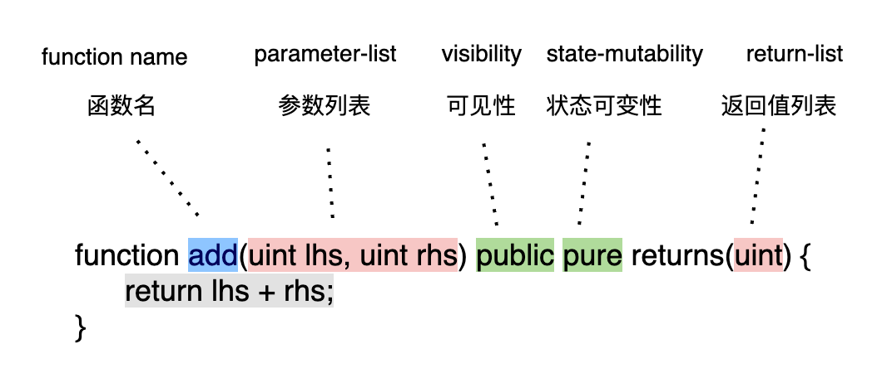
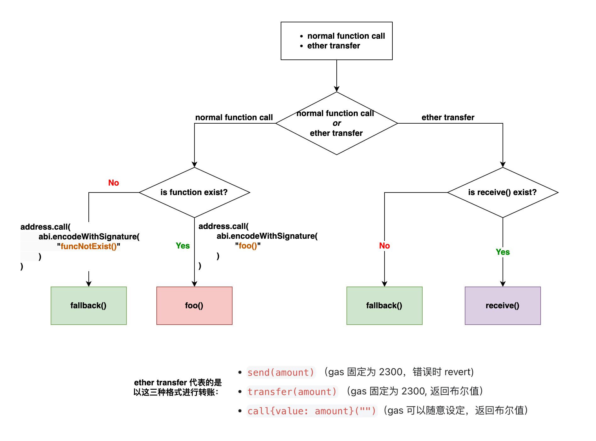

# 合约
使用`contract`关键字来定义一个新的合约：
```solidity
contract myContractName {
    // members
}

```
## 合约的组成结构
- 构造函数：用于初始化合约的状态，只在合约创建时执行一次。
- 函数：包含一组逻辑代码块，负责执行合约的主要功能，可以被外部或内部其他函数调用。
- 修饰器：用于修改或限制函数的行为，增强函数的复用性和安全性。
- fallback 函数：当调用合约的函数不存在时执行的特殊函数，用于处理意外的函数调用或额外的数据。
- receive 函数：专门用来接收以太币（Ether）转账的特殊函数，当合约被发送以太币且未调用任何函数时触发。
- 结构体：自定义的数据类型，用于组织和存储多个不同类型的数据项。
- 枚举类型：定义有限个数值的集合，用于提高代码的可读性和增强类型安全。
- 事件：用于记录合约中发生的特定操作，类似于日志功能，便于外部监听和响应合约的活动。
- 自定义值类型：允许用户定义新的值类型，可以基于现有的 Solidity 类型，增强代码的清晰度和效率。
- Error：定义可能在函数执行中抛出的错误，这些错误可以被捕获和处理，增强合约的安全性和稳定性。
- using 语句：使当前合约能够使用指定库中定义的函数或类型，无需显式调用，简化代码并增强功能。

# constant
在 Solidity 中，`constant` 关键字用于定义常量，即那些在编译时就确定且之后无法更改的变量。使用 `constant` 关键字可以确保一旦值被设定，就无法被意外或恶意修改，从而提高智能合约的安全性
```solidity
// 示例
uint constant ratio = 3;
```
**constant 的值必须能在编译期间确定**
```solidity
uint a = 3;
uint constant ratio = a; // 不合法，不能用普通变量给 constant 赋值

uint constant b; // 不合法，必须在声明时就赋值
```

**constant 不能更改**
```solidity
uint constant ratio = 3;

constructor() {
    ratio = 0; // 不合法
}

function f() public {
    ratio = 0; // 不合法
}
```


# immutable
在 Solidity 中，`immutable` 和 `constant` 关键字都用于定义变量的值只能设置一次，不过 `immutable` 相比 `constant` 提供了更灵活的初始化选项。
## immutable 变量声明
声明时初始化
```solidity
uint immutable n = 5;
```
在构建时初始化
```solidity 
uint immutable n;

constructor () {
    n = 5;
}
```
**不能初始化两次**
```solidity
uint immutable n = 0;

constructor () {
    n = 5; // 不合法，已经在声明时初始化过了
}
```

**immutable 变量不能更改**
```solidity
uint immutable n = 0; // 初始化为0

function f() public {
    n = 5; // 不合法，immutable 变量不能更改
}
```

# 函数
在 Solidity 中，函数是智能合约的核心组件之一，包含一组执行特定操作或行为的逻辑代码块。它们定义了合约可以执行的各种功能，是构建合约的基础。例如，一个借贷合约可能会包含多个函数来处理不同的金融操作，如提供资金（supply），借出资金（borrow），和还款（repay）等。每个函数都封装了实现这些操作所需的逻辑，允许合约用户在区块链上执行复杂的交互。

实现了一个 `add` 函数，对两个数相加求和
```solidity
function add(uint lhs, uint rhs) public pure returns(uint) {
    return lhs + rhs;
}
```

Solidity 中，函数的声明需语法规则: 
- `function`：函数声明以关键字 `function` 开始。
- `add`：这是函数的名称，用于标识这个特定的函数。
- `(uint lhs, uint rhs)`：这是函数的输入参数列表，包含两个参数：`lhs` 和 `rhs`，它们都是无符号整型（`uint`）。
- `public`：这是函数的可见性修饰符。`public` 表示该函数可以被合约内部的其他函数以及外部调用。
- `pure`：这是函数的状态可变性修饰符。`pure` 表示该函数不会读取或修改合约的状态。
- `returns(uint)`：这定义了函数的返回类型，本例中为一个无符号整型（`uint`）。
- `{ return lhs + rhs; }`：这是函数的主体部分，包含实际要执行的逻辑。在此例中，函数逻辑是返回两个参数 `lhs` 和 `rhs` 的和。
## 参数列表
可以为函数提供零或多个参数。多个参数可以使用逗号进行分割
```solidity
// 提供0个参数
function foo() public {};

// 提供1个参数
function foo(uint a) public {};

// 提供多个参数
function foo(uint a, uint b, uint c) public {};
```

## 返回值列表
可以为函数提供零或多个返回值。多个返回值可以使用逗号进行分割
```solidity
// 提供0个返回值
function foo() public {};

// 提供1个返回值
function foo() public returns(uint) {};

// 提供多个返回值
function foo() public returns(uint, uint, uint) {};
```

## 函数可见性
在 Solidity 中，正确设置变量和函数的可见性修饰符是保证智能合约安全性和功能正确性的关键。以下是变量和函数可用的可见性修饰符及其具体含义：

**变量的可见性修饰符**
- `public`：变量可以被当前合约内部以及外部访问。对于 `public` 变量，Solidity 自动创建一个访问器函数，允许外部合约也可以读取这些变量。
- `private`：变量只能被定义它的合约内部访问。即使是派生合约也无法访问 `private` 变量。
- `internal`：变量可以被当前合约以及所有派生自该合约的“子合约”访问，但不能被外部合约直接访问。
**函数的可见性修饰符**
- `public`：函数可以在当前合约内部和外部被访问。这是函数默认的可见性级别，如果没有指定其他修饰符。
- `external`：函数只能从合约外部被调用。这种修饰符通常用于那些不需要在合约内部调用的函数，可优化 gas 消耗。
- `private`：函数仅限于在定义它的那个合约内部被调用，不可在任何外部合约或派生合约中访问。
- `internal`：函数可以在定义它的合约内部以及所有派生自该合约的子合约中被调用，但不能从外部合约调用。

### 合约分类

#### 主合约
主合约其实就是一个普通合约，内部定义了很多变量和函数。这些变量和函数可能有不同的可见性。主合约可以访问自己内部可见性为 `private` ， `internal` ， `public` 的任何变量和函数。
```solidity
// 主合约可以访问自己内部可见性为 private, internal, public 的变量和函数
contract MainContract {
    uint varPrivate;
    uint varInternal;
    uint varPublic;

    function funcPrivate() private {}
    function funcInternal() internal {}
    function funcExternal() external {}
    function funcPublic() public {}
}
```

#### 子合约
子合约继承了主合约。继承的语法是 Child is Parent, 子合约允许访问主合约中可见性为 `internal` ， `public` 的函数。
```solidity
contract ChildContract is MainContract {
    function funcChild() private {
        funcInternal(); // 子合约可以访问主合约中可见性为internal，public的函数
        funcPublic(); // 子合约可以访问主合约中可见性为internal，public的函数
    }
}
```

#### 第三方合约
第三方合约是一个普通合约。可以通过主合约的地址来与主合约进行交互, 第三方合约可以访问主合约中可见性为 `external` ， `public` 的函数
```solidity
contract ThirdPartyContract {
      function funcThirdParty(address mainContractAddress) private {
            // 第三方合约可以访问主合约中可见性为external，public的函数
            MainContract(mainContractAddress).funcExternal(); 
            // 第三方合约可以访问主合约中可见性为external，public的函数
            MainContract(mainContractAddress).funcPublic(); 
      }
}
```
### 可见性对于合约访问的限制
- 主合约可以访问自己内部可见性为 `private` ， `internal` ， `public` 的变量和函数。
- 子合约可以访问主合约中可见性为 `internal` ， `public` 的函数。
- 第三方合约可以访问主合约中可见性为 `external` ， `public` 的函数。

## 函数状态可变性
在 Solidity 中，函数状态可变性指的是函数是否有能力修改合约的状态。默认情况下，函数被认为是可以修改合约状态的，即它们可以写入或更改合约中存储的数据。在某些情况下，如果希望明确地限制函数不改变合约状态，提高合约的安全性和可读性，可以使用状态可变性修饰符来实现这一点
- `view`：这种类型的函数仅能查询合约的状态，而不能对状态进行任何形式的修改。简而言之，`view` 函数是只读的，它们可以安全地读取合约状态但不会造成任何状态改变。
- `pure`：`pure` 函数表示最严格的访问限制，它们不能查询也不能修改合约状态。这类函数只能执行一些基于其输入参数的计算并返回结果，而不依赖于合约中存储的数据。例如，一个计算两数相加的函数可以被标记为 `pure`。
- `payable`：`payable` 修饰符允许函数接收以太币（Ether）转账。在 Solidity 中，函数默认是不接受以太币转账的；如果你的函数需要接收转账，则必须明确指定为 `payable`。这是处理金融交易时必不可少的修饰符。

### 怎样才算查询合约状态
1. 读取状态变量：直接访问合约中定义的任何状态变量。
2. 访问余额：使用 `address(this).balance` 或 `<address>.balance` 来获取合约或任何地址的当前以太币余额。
3. 访问区块链特性：通过 `block`，`tx`，`msg` 等全局变量的成员访问区块链的特定数据。例如，`block.timestamp` 获取区块的时间戳，`msg.sender` 获取消息发送者的地址。
4. 调用非 pure 函数：任何未明确标记为 `pure` 的函数调用。即便函数本身没有修改状态，但如果它没有被标记为 `pure`，调用它仍被视为状态查询。
5. 使用内联汇编：特别是那些包含某些操作码的内联汇编，这些操作码可能会读取或依赖于链上数据。

### 怎样才算修改合约状态
1. 修改状态变量：直接改变存储在合约中的任何状态变量的值。
2. 触发事件：在合约中发出事件，这通常用于记录合约活动，尽管本身不改变任何存储的状态变量，但被视为状态改变，因为它改变了链上的日志。
3. 创建其他合约：通过合约代码创建新合约实例。
4. 使用 `selfdestruct`：销毁当前合约，并将剩余的以太币发送到指定地址。
5. 通过函数发送以太币：包括使用 `transfer` 或 `send` 方法发送以太币。
6. 调用非 `view` 或 `pure` 的函数：调用任何可能改变状态的函数，如果函数未明确标记为 `view` 或 `pure`，则默认可能修改状态。
7. 使用低级调用：如 `call`、`delegatecall`、`staticcall` 等。这些低级函数允许与其他合约交互，并可能导致状态变化。
8. 使用含有特定操作码的内联汇编：特定的汇编代码可能直接修改状态，例如直接写入存储或执行控制合约资金的操作。

## recive函数
`receive` 函数是 Solidity 中的一种特殊函数，主要用于接收以太币（Ether）的转账
**语法**
```solidity
receive() external payable {
    // 函数体
}
```
**合约没有定义 `receive` 和 `fallback` 函数时，不能对其转账**

### 注意 Gas 不足的问题
在定义 `receive` 函数时，需要特别注意 Gas 不足的问题。前面我们提到，`send` 和 `transfer` 方法的 Gas 是固定为 2300 的。因此，这些方法剩余的 Gas 往往不足以执行复杂操作。如果 `receive` 函数体需要执行较复杂的操作，那么可能会抛出“Out of Gas”异常。

以下操作通常会消耗超过 2300 Gas：
- 修改状态变量
- 创建合约
- 调用其他相对复杂的函数
- 发送以太币到其他账户

例如，下面的 `receive` 函数由于消耗的 Gas 超过了 2300，因此它总是会被 revert：
`receive` 函数消耗过多 GAS
```solidity
// 用send,transfer函数转账到该合约都会被 revert
// 原因是消耗的 Gas 超过了 2300
contract Example {
    uint a;
    receive() external payable {
        a += 1;
    }
}
```

## fallback函数
`fallback` 函数是 Solidity 中的一种特殊函数，用于在调用的函数不存在或未定义时充当兜底。
**语法**
```solidity
fallback() external payable {
    // 函数体
}
```
**合约没有定义 `receive` 和 `fallback` 函数时，不能对其转账**

- 当需要用到 `receive` 函数时，如果它没有被定义，就使用 `fallback` 函数兜底。
- 当调用的函数在合约中不存在或没有被定义时，也使用 `fallback` 函数兜底。
下面的图示描述了 `fallback` 函数的兜底机制，其中左半部分描述了普通函数的兜底，右半部分描述了 `receive` 函数的兜底：


### 示例：receive 和 fallback 函数被调用场景
```solidity
// SPDX-License-Identifier: GPL-3.0

pragma solidity ^0.8.17;

contract Callee {
    event FunctionCalled(string);

    function foo() external payable {
        emit FunctionCalled("this is foo");
    }

    // 可以注释掉 receive 函数来模拟它没有被定义的情况
    receive() external payable {
        emit FunctionCalled("this is receive");
    }

    // 可以注释掉 fallback 函数来模拟它没有被定义的情况
    fallback() external payable {
        emit FunctionCalled("this is fallback");
    }
}

contract Caller {
    address payable callee;

    // 注意： 记得在部署的时候给 Caller 合约转账一些 Wei，比如 100
    // 因为在调用下面的函数时需要用到一些 Wei
    constructor() payable{
        callee = payable(address(new Callee()));
    }

    // 触发 receive 函数
    function transferReceive() external {
        callee.transfer(1);
    }

    // 触发 receive 函数
    function sendReceive() external {
        bool success = callee.send(1);
        require(success, "Failed to send Ether");
    }

    // 触发 receive 函数
    function callReceive() external {
        (bool success, bytes memory data) = callee.call{value: 1}("");
        require(success, "Failed to send Ether");
    }

    // 触发 foo 函数
    function callFoo() external {
        (bool success, bytes memory data) = callee.call{value: 1}(
            abi.encodeWithSignature("foo()")
        );
        require(success, "Failed to send Ether");
    }

    // 触发 fallback 函数，因为 funcNotExist() 在 Callee 没有定义
    function callFallback() external {
        (bool success, bytes memory data) = callee.call{value: 1}(
            abi.encodeWithSignature("funcNotExist()")
        );
        require(success, "Failed to send Ether");
    }
}
```


## 函数修饰器
在 Solidity 中，修饰器（modifier）是一种特殊的声明，它用于修改智能合约函数的行为。通过在函数执行前添加预处理和验证逻辑，修饰器可以确保函数在特定条件下运行，例如验证函数的输入参数是否符合预设标准，或确认调用者是否具备特定权限。使用修饰器不仅能增强代码的复用性，还能提升其可读性。

考虑以下情况：在一个合约中，几个函数（如 `mint`、`changeOwner`、`pause`）需要确保只有合约的所有者（owner）才能调用它们。通常，我们需要在每个这样的函数前用 `require(msg.sender == owner, "Caller is not the owner");` 来检查调用者的身份。这种逻辑在多个函数中重复出现，不仅冗余，而且每次更改时都需要手动更新每个函数。

用 `require` 来进行权限检查

```solidity
pragma solidity ^0.8;

contract ExampleContract {
    address private owner;

    constructor() {
        owner = msg.sender;
    }

    function mint() external {
        require(msg.sender == owner, "Only the owner can call this function.");
        // Function code goes here
    }

    function changeOwner() external {
        require(msg.sender == owner, "Only the owner can call this function.");
        // Function code goes here
    }

    function pause() external {
        require(msg.sender == owner, "Only the owner can call this function.");
        // Function code goes here
    }
}
```

在这种情况下，我们可以把权限检查的代码抽出来，变成一个修饰器。如果有函数需要权限检查时就可以添加这个修饰器去修饰函数行为
用修饰器来进行权限检查: 
```solidity
pragma solidity ^0.8.17;

contract ExampleContract {
    address private owner;

    constructor() {
        owner = msg.sender;
    }

    // 将权限检查抽取出来成为一个修饰器_
    modifier onlyOwner() {
        require(msg.sender == owner, "Only the owner can call this function.");
        _;
    }

    // 添加 onlyOwner 修饰器来对调用者进行限制_
    // 只有 owner 才有权限调用这个函数_
    function mint() external onlyOwner { 
        // Function code goes here
    }

    // 添加 onlyOwner 修饰器来对调用者进行限制_
    // 只有 owner 才有权限调用这个函数_
    function changeOwner() external onlyOwner {
        // Function code goes here
    }

    // 添加 onlyOwner 修饰器来对调用者进行限制_
    // 只有 owner 才有权限调用这个函数_
    function pause() external onlyOwner {
        // Function code goes here
    }
}
```
定义修饰器之后，你可以将其应用于任何函数。修饰器紧跟在函数的参数列表后面。这里是一个示例，展示了如何定义和使用修饰器：

添加单个修饰器

```solidity
function foo() public modifier1 {
    // function body
}
```

添加多个修饰器，它们的执行顺序是从左到右的

```solidity
function foo() public modifier1, modifier2, modifier3 {
    // function body
}
```

Solidity 有哪些全局的数学和密码学函数？
- 数学函数：
- `addmod(uint x, uint y, uint k) returns (uint)`
    - 计算 `(x + y) % k`，加法会在任意精度下执行，并且加法的结果即使超过 `2**256` 也不会被截取。从 0.5.0 版本的编译器开始会加入对 `k != 0` 的校验（assert）。
- `mulmod(uint x, uint y, uint k) returns (uint)`
    - 计算 `(x * y) % k`，乘法会在任意精度下执行，并且乘法的结果即使超过 `2**256` 也不会被截取。从 0.5.0 版本的编译器开始会加入对 `k != 0` 的校验（assert）。
- 密码学函数：
- `keccak256((bytes memory) returns (bytes32)`
    - 计算 Keccak-256 哈希，之前 keccak256 的别名函数 **sha3** 在 **0.5.0** 中已经移除。。
- `sha256(bytes memory) returns (bytes32)`
    - 计算参数的 SHA-256 哈希。
- `ripemd160(bytes memory) returns (bytes20)`
    - 计算参数的 RIPEMD-160 哈希。
- `ecrecover(bytes32 hash, uint8 v, bytes32 r, bytes32 s) returns (address)`
    - 利用椭圆曲线签名恢复与公钥相关的地址，错误返回零值。
    - 函数参数对应于 ECDSA 签名的值:
        - r = 签名的前 32 字节
        - s = 签名的第 2 个 32 字节
        - v = 签名的最后一个字节
    - ecrecover 返回一个 address, 而不是 address payable。