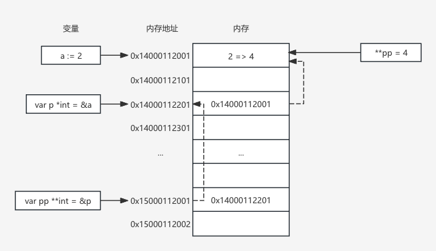

Go 中，指针是一个变量，它存储了另一个变量的内存地址。通过指针，可以访问存储在指定内存地址中的数据。
# 指针的声明与初始化
在 Go 中, 声明一个指针类型变量使用星号`*`标识
```go
// 语法
var <name> *<type>
```
初始化指针必须通过另一个变量
```go
// 没有赋值
p = &<var name>
```
也可以使用一个结构体实例或变量直接声明并且赋值给一个指针
```go
p := &<struct type>{}
p := &<var name>
```
同时还可以获取指针的地址
```go
var p **<type>
```
## 代码示例
```go
var p1 *int
var p2 *string

i := 1
s := "Hello"
// 基础类型数据，必须使用变量名获取指针，无法直接通过字面量获取指针
// 因为字面量会在编译期被声明为成常量，不能获取到内存中的指针信息
p1 = &i
p2 = &s

p3 := &p2
fmt.Println(p1)
fmt.Println(p2)
fmt.Println(p3)
```

# 使用指针访问值
```go
var p1 *int
i := 1
p1 = &i
fmt.Println(*p1 == i)
*p1 = 2
fmt.Println(i)
```

# 修改指针指向的值
```go
a := 2  // 声明变量a并赋值为2（int类型）
var p *int  // 声明一个指向int类型的指针p（初始值为nil）

// 打印a的内存地址（格式类似0xc00001a0a8，具体地址每次运行可能不同）
fmt.Println(&a)  

p = &a  // 将a的地址赋值给指针p，此时p指向a
// 打印p的值（即a的地址）和a的地址，两者完全相同
fmt.Println(p, &a)  

var pp **int  // 声明一个二级指针pp（指向"int指针"的指针，初始值为nil）
pp = &p  // 将p的地址赋值给pp，此时pp指向p
// 打印pp的值（即p的地址）和p的值（即a的地址），两者不同
fmt.Println(pp, p)  

** pp = 3  // 解引用二级指针pp：先通过*pp得到p，再通过*p得到a，最终将3赋值给a
// 打印pp（p的地址）、*pp（p的值，即a的地址）、p（a的地址）
fmt.Println(pp, *pp, p)  

// 打印**pp（a的值，即3）和*p（a的值，即3）
fmt.Println(** pp, *p)  

// 打印a的值（3）和a的地址（与之前相同，地址不会因值变化而改变）
fmt.Println(a, &a)
```
示例操作示意图



**指针变量本身也是变量，也就同样可以把指针变量的内存地址赋值给另外一个指针，所以就有了 `**<type>`（指针的指针），并且这个模式理论上是可以一直循环，Go 并没有对这种情况加以限制**

## 指针计算
**在 Go 中,指针不能直接参与计算, 否则在编译的时候就报错**
Go 中提供了其他方式，来操作指针，即引入了 unsafe.Point 类型和 uintptr 类型，来帮助操作指针
```go
// 把指针转换成 unsafe.Pointer:
var p *<type>
var a <type>
p = &a

up1 := unsafe.Pointer(p)
up2 := unsafe.Pointer(&a)

// 把 unsafe.Pointer 转成 uintptr
uintpr = uintptr(up1)

// 示例
a := "Hello, world!"
upA := uintptr(unsafe.Pointer(&a))
upA += 1

c := (*uint8)(unsafe.Pointer(upA))
fmt.Println(*c)
```